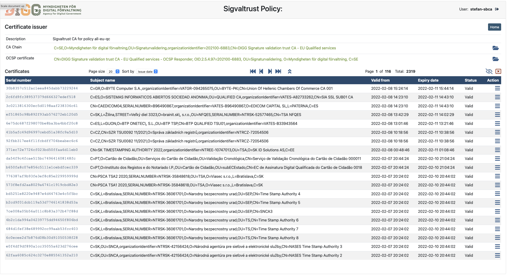
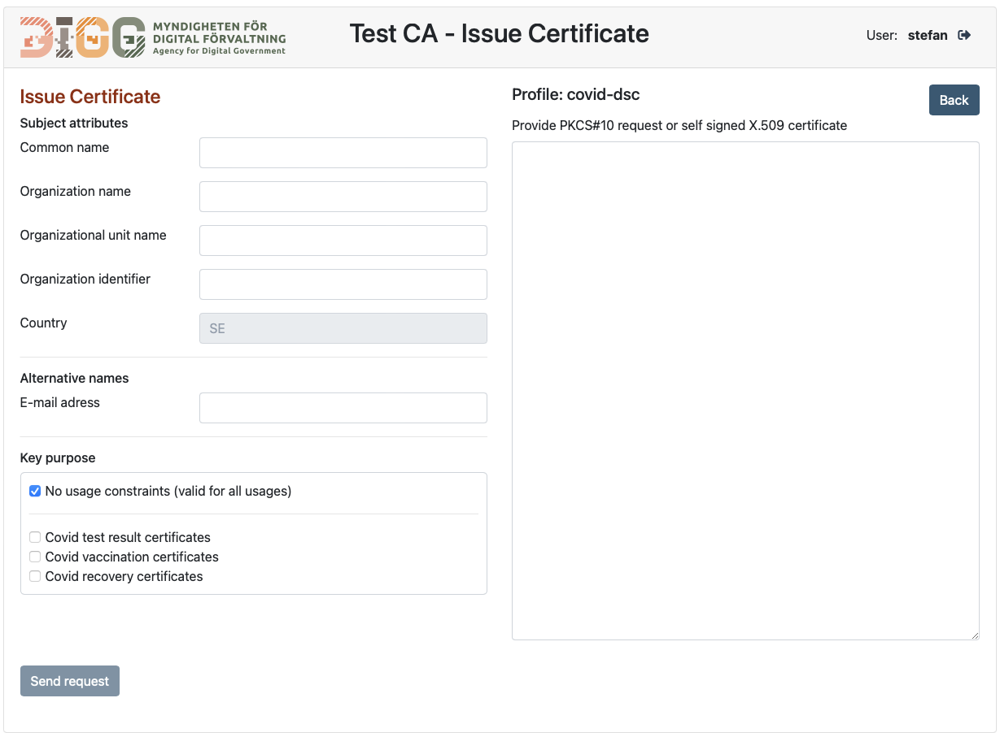
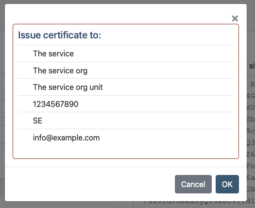
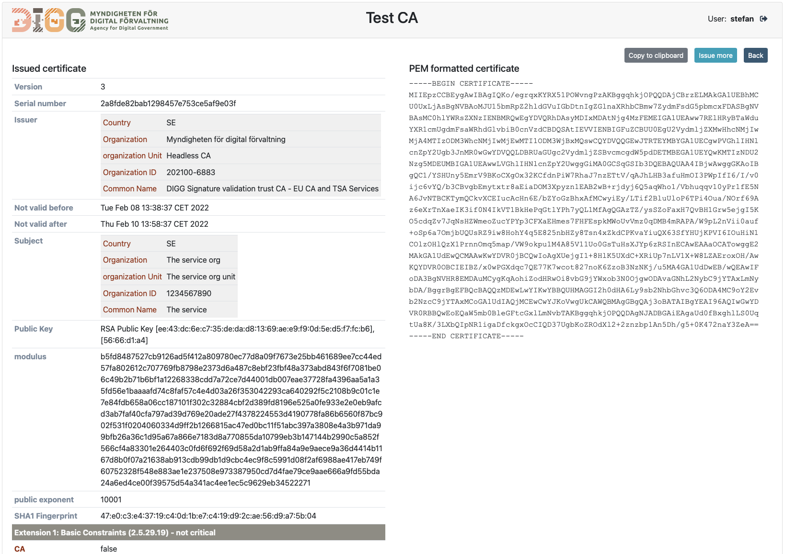
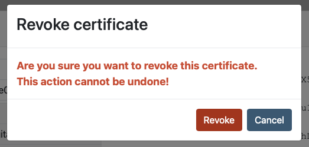

# CA admin GUI based on CMC API

[](https://opensource.org/licenses/Apache-2.0)

---



This repo contains the source code for a detached CA admin application service that controls a CA service using a CMC API. 
The source code builds a Spring Boot application that may be deployed as is, or may be built into a Docker image using any of the provided Dockerfile examples.

This document provides build, deployment and operational instructions. Example files used to illustrate service deployment are provided in the `documentation/sample-config` folder.

The CA service application may hold any number of Certification Authority (CA) services, refered to as "**Instances**".

Each CA instance has its own administration web page, its own CA repository and its own revocation services. This CA service has a simple manual administration interface for issuing and revoking certificates. No API is provided for receiving and validating requests from other services by automated means. The administration UI of this service requires login using username and password. While OCSP and CRL:s allways must be made available on the public internet, the admin UI can be configured to be exposed on the main service port och can be directed to a secondary service port only made available on the local network.

## 1. Building artifacts
### 1.1. Building the source code

Building source codes referred to here requires maven version 3.3 or higher. This project can be built and can run on Java 11 or higher.
It has been tested with Java 17 JRE

Build with the following command:

> mvn clean install

The master branch of each repo holds the latest code under development. This is typically a SNAPSHOT version.
For deployment, it is advisable to build a release version. Each release have a corresponding release branch. To build the source code, select the release branch of the latest release version before building the source code.


### 1.2 Building a docker image

Three sample Dockerfile files are provided:

| Dockerfile         | Description                                                                                |
|--------------------|--------------------------------------------------------------------------------------------|
| Dockerfile         | Builds a docker image that exposes all relevant default ports                              |
| Dockerfile-debug   | Builds a docker image that allows attachment of a remote debugger on application port 8000 |


Please refer to the Docker manual for instructions on how to build and/or modify these docker images.


## 2. Configuration

### 2.1. Environment variables
The following environment variables are essential to the CA application:

| Environment variable                | Description                                                                                                                                                                                                                                                                                                                                                                                                                                                           |
|-------------------------------------|-----------------------------------------------------------------------------------------------------------------------------------------------------------------------------------------------------------------------------------------------------------------------------------------------------------------------------------------------------------------------------------------------------------------------------------------------------------------------|
| `SPRING_CONFIG_ADDITIONAL_LOCATION` | Specifies the absolute path location of the configuration data folder. This folder must specify a location that is available to the CA application and the CA application must have write access to this folder and all its sub-folders. The absolute path specified by this variable must end with a delimiter ("/") so that `${SPRING_CONFIG_ADDITIONAL_LOCATION}child` specifies the absolute path of the child folder. (Note: this is a rule set by Spring Boot). |
| `TZ`                                | Specifies the timezone used by the application. Example "`Europe/Stockholm`"                                                                                                                                                                                                                                                                                                                                                                                          |

The `documentation/sample-config` folder contains sample configuration data. a corresponding folder must be available to the application following the absolut path specified by `SPRING_CONFIG_ADDITIONAL_LOCATION`.


### 2.2. Configuration files
The configuration folder holds the main configuration file `application.properties`. The configuration folder holds no other mandatory structure. 
Location of resources such as logotype images, keystore file and trusted certificates are specified in the `application.properties` configuration file.

#### 2.2.1 Process logging levels

Process logging levels are set according to Spring Boot conventions. Two logging levels are preset:

| Logging level property                         | Description                                          |
|------------------------------------------------|------------------------------------------------------|
| logging.level.se.swedenconnect.ca.cmcclient    | Setting logging level for the CA CMC client service. |

Logging levels can be set to the values: `TRACE`, `DEBUG`, `INFO`, `WARN` or `ERROR`

#### 2.2.2 Users

Users are added to the system through property settings in the form:

> ca-client.security.user.{user-id}.password={user-password}<br>
> ca-client.security.user.{user-id}.role={instance-id1},instance-id2}<br>

or as a coma separated list:

> ca-client.security.user.{user-id}.password={user-password}<br>
> ca-client.security.user.{user-id}.role={instance-id1},instance-id2}<br>

The user ID is set by the parameter {user-id1} and {user-id2}, and each instance of the CA that this user is allowed to access and mange is listed as a `role` value. The following settings illustrate configuration of 2 users (root-admin and ca-admin) where the root-admin user has access to the instances rot01 and ca01, while the ca-admin just has access to the ca01 instance.

```
ca-client.security.user.root-admin.password=user1pass
ca-client.security.user.root-admin.role=rot01,ca01
ca-client.security.user.ca-admin.password=user2pass
ca-client.security.user.ca-admin.role=ca01
```


#### 2.2.3 Main service settings

All regular general Spring Boot `application.properties` settings apply to this service. In addition to these properties, this service define a number of its own general service settings.
The following properties should be set to appropriate values.

**Main service settings**

| Propety                                  | Value                                                                                                                                                                                              |
|------------------------------------------|----------------------------------------------------------------------------------------------------------------------------------------------------------------------------------------------------|
| server.port                              | The main server port. Default 8080                                                                                                                                                                 |
| server.servlet.context-path              | the context path of the service under its published URL. typically `/ca-admin`                                                                                                                     |
| ca-client.config.base-url                | The base URL of the CA service (Only protocol and host name such as: https://edelivery.idsec.se), not including any path information.                                                              |
| ca-client.config.verbose-cert-print      | Determines the level of detail in presentation of certificate information. Default set to `false`. Setting this to true will for example print the content of signature values and key parameters. |
| ca-client.config.logo                    | The path to the logo of the service. Typically set to ${ca-service.config.data-directory}cfg/logo.svg                                                                                              |
| ca-client.config.icon                    | The path to the icon of the service. Typically set to ${ca-service.config.data-directory}cfg/icon.svg                                                                                              |
| ca-client.config.http.connectTimeout     | Timeout in milliseconds before a connect attempt must succeed                                                                                                                                      |
| ca-client.config.http.readTimeout        | Timeout in milliseconds setting the maximum download time for remote data                                                                                                                          |
| ca-client.config.page-sizes              | Number of certificate per page offered by the admin GUI specified as a coma separates list of integers. Typical values = 20,50,100,200,500                                                         |
| ca-client.config.page-size-default-index | The index of the default value of the list of certificate per page in the previous setting. A value of 0 means that the first option is the default option.                                        |

**Certified key constraints**

These settings define the allowed public key types and minimum key length requirements for this CA to allow certification of a presented public key in a certification request.

| Property                          | Value                                                |
|-----------------------------------|------------------------------------------------------|
| ca-client.policy.rsa-keys-allowed | Set to true to allow RSA public keys                 |
| ca-client.policy.rsa-min-key-len  | Minimum RSA key length. Default 3072                 |
| ca-client.policy.ec-keys-allowed  | Set to true to allow Elliptic Curve (EC) public keys |
| ca-client.policy.ec-min-key-len   | Minimum EC key length. Default 256                   |

#### 2.2.4 TLS configuration

The Spring boot application may provide its services over encrypted TLS as alternative to the main service port. This communication is always offered on port 8443. TLS is configured using the following standard Spring Boot properties

| Propety                       | Value                                                                                                         |
|-------------------------------|---------------------------------------------------------------------------------------------------------------|
| server.ssl.key-store          | Location of the TLS server key and certificate such as ${ca-service.config.data-directory}cfg/sslSnakeOil.p12 |
| server.ssl.key-store-type     | Key store type, such as `PKCS12`                                                                              |
| server.ssl.key-store-password | Key store password                                                                                            |
| server.ssl.key-password       | Key password                                                                                                  |
| server.ssl.enabled            | Set to true to enable TLS                                                                                     |

These settings are disabled by default

#### 2.2.5 AJP port configuration

AJP is disabled by default. AJP protocol support can be enabled ans specified using the following property settings:

| Property           | Value                                                                                                                                                                                                                                        |
|--------------------|----------------------------------------------------------------------------------------------------------------------------------------------------------------------------------------------------------------------------------------------|
| tomcat.ajp.enabled | Set to true to enable AJP support                                                                                                                                                                                                            |
| tomcat.ajp.port    | Set the AJP port. Typically 8009                                                                                                                                                                                                             |
| tomcat.ajp.secret  | Sets an AJP secret to enhance security between the application and the web server. If this secret is absent, then AJP is provided with secure mode set to false and without AJP secret. This is not recommended for production environments. |


#### 2.2.7 Service key and PKCS#11 configuration

PKCS#11 configuration is only applicable if the service is connected to a HSM key source. For more details on HSM configuration, see chapter 4.

A service key source is configured using the following properties in `application.properties`.

| Property                                             | Value                                                                                                                                                                                                                                                                                                  |
|------------------------------------------------------|--------------------------------------------------------------------------------------------------------------------------------------------------------------------------------------------------------------------------------------------------------------------------------------------------------|
| ca-client.config.keys.pkcs11config-location          | Optional absolute path to a SUN PKCS#11 configuration file. (See [Java PKCS#11 Reference guide](https://docs.oracle.com/en/java/javase/11/security/pkcs11-reference-guide1.html)). This configuration file, if present, provides configuration of a PKCS#11 based key source provided in a HSM module. |
| ca-client.config.keys.credentials.cmc.credentialtype | Identifier of the credential type holding the configured private key.  Valid values are `jks`, `pkcs12`, `pkcs11` and `pem`. If pem formatted keys are provided, the private kay may be encrypted if the encrypted key can be decrypted using the provided password.                                   |
| ca-client.config.keys.credentials.cmc.key-location   | THe location of the private key (ignored if pkcs11 is used). A typical value is `${ca-client.config.data-directory}keystores/cmc-client.jks`.                                                                                                                                                          |
| ca-client.config.keys.credentials.cmc.cert-location  | Location of external certificate file. This parameter is only relevant in combination with `credentialtype` = `pem` or `pkcs11`.                                                                                                                                                                       |
| ca-client.config.keys.credentials.cmc.alias          | The alias of the private key (Not applicable for pem keys).                                                                                                                                                                                                                                            |
| ca-client.config.keys.credentials.cmc.password       | The password used to access the key.                                                                                                                                                                                                                                                                   |


#### 2.2.8 CMC configuration

This CA admin application may provide admin capabilities for any number of CA instances where each CA instance is managed using a CMC API. All CMC requests will be signed using the service CMC key setup in the previous section.
The algorithm used to sign CMC requests with this key must be specified using the following property value:

> ca-client.config.cmc.algorithm

CMC Signing algorithm is specified using a URI identifier (not OID) e.g. `ca-client.config.cmc.algorithm=http://www.w3.org/2001/04/xmldsig-more#ecdsa-sha256`

Each CA instance is configured using the following property settings (where parameter {instance-name} is the instance id tag of each CA instance):

| Property                                                                  | Value                                                                                                                                                                                  |
|---------------------------------------------------------------------------|----------------------------------------------------------------------------------------------------------------------------------------------------------------------------------------|
| ca-client.config.cmc.instance.{instance-id}.request-url                   | The request URL where CMC requests are sent to the CA instance                                                                                                                         |
| ca-client.config.cmc.instance.{instance-id}.response-certificate-location | The absolute path to the PEM certificate used to verify CMC responses from the CA                                                                                                      |
| ca-client.config.cmc.instance.{instance-id}.ca-certificate-location       | The absolute path th a PEM certificate used as CA issuing certificate. This certificate is used to verify issued certificates returned over the CMC API                                |
| ca-client.config.cmc.instance.{instance-id}.name                          | The display name of this CA instance used in the admin GUI                                                                                                                             |
| ca-client.config.cmc.instance.{instance-id}.description                   | A description of this CA instance used in the admin GUI                                                                                                                                |
| ca-client.config.cmc.instance.{instance-id}.profile                       | The name of the certificate profile used to issue certificates using this CA instance                                                                                                  |
| ca-client.config.cmc.instance.{instance-id}.policy                        | An optional coma separated list of certificate policies included in certificates issued by this CA. Any setting provided here may be superseded by settings in the certificate profile |
| ca-client.config.cmc.instance.{instance-id}.index                         | The index deciding the display order in the admin GUI when listing configured CA instances                                                                                             |

#### 2.2.9 Certificate Profile configuration

The content of an issued certificate is ultimately decided by the CA service issuing the certificates setting the constraints for what is allowed. 
This CA admin service allows creation of certificate profiles withing the constraints set by the CA service. Whether the CA enforce such constraints, and what those constraints are, is outside the scope of this discussion. It is the responsibility of the 
administrator configuring this service to make sure that any defined certificate profile will be accepted by the CA service.

Each certificate profile is identified by a profile ID, references in the CMC instance configuration where each CA instance is assigned to a certificate profile defined here.

Certificate profiles are defined by a mandatory set of default values and optional profile values.

Default values are defined using the following property prefix:

> ca-client.certificate-profiles.default-value

Each profile is then set by the following property prefix:

> ca-client.certificate-profiles.profile.{profile-id}

Only the values deviating from the set default value need to be set.

The following property values can be set, amending the property prefix values above:

| Property               | Value                                                                                                                                                                     |
|------------------------|---------------------------------------------------------------------------------------------------------------------------------------------------------------------------|
| request-attributes     | List of attributes to be requested in the admin GUI (cert issuance page). Se below for available values.                                                                  |
| request-subj-alt-names | List of attributes to be requested in the admin GUI (cert issuance page). Se below for available values.                                                                  |
| request-eku            | List of attributes to be requested in the admin GUI (cert issuance page). Se below for available values.                                                                  |
| requestOther           | List of other parameters to be requested in the admin GUI (cert issuance pge). For future use                                                                             |
| requestFixedValue      | A map of fixed input values that will be displayed in the GUI, but where the content is locked to the fixed value. Specified as a coma separated list of key/value pairs. |
| include-aki            | Set to true to include Authority Key Identifier in the issued certificate (As a copy of the SKI in the issuing certificate)                                               |
| include-ski            | Set to true to include a Subject Key Identifier in the issued certificate                                                                                                 |
| include-crl-dp         | Set to true to include a CRL distribution point in the issued certificate                                                                                                 |
| include-ocsp-url       | Set to true to include a OCSP location in the issued certificate (provided that the issuing CA supports OCSP).                                                            |
| ca                     | Set to true if the issued certificate should be issued as a CA certificate (basic constraints ca=true)                                                                    |
| bc-critical            | Set to true to force the basic constraints extension to be set to critical.                                                                                               |
| policy                 | A coma separated list of policy OID:s that should be included in the issued certificate (Setting any-policy below invalidates this setting)                               |
| any-policy             | Set to true to include the special policy anyPolicy in the issued certificate                                                                                             |
| policy-critical        | Set to true to make any present certificate policy extension critical                                                                                                     |
| eku                    | A coma separated list of EKU (Extended Key Usage) identifiers to be included in the issued certificate (without prompting in the GUI). Se below for available values.     |
| eku-critical           | Set to true to make any present EKU extension critical.                                                                                                                   |
| key-usages             | A coma separated list of key usage setting options. Se below for available values.                                                                                        |
| key-usage-critical     | Set to true to make any present key usage extension critical                                                                                                              |
| subj-alt-name-critical | Set to true to make any present Subject Alt Name extension critical                                                                                                       |


**Available values for request-attributes:**

| Value            | Description                              |
|------------------|------------------------------------------|
| commonName       | X.520 Common name attribute              |
| title            | X.520 Title attribute                    |
| givenName        | X.520 Given name attribute               |
| surname          | X.520 Surname attribute                  |
| serialNumber     | X.520 Serial number attribute            |
| organizationName | X.520 Organization name attribute        |
| orgUnitName      | X.520 Organizational unit name attribute |
| orgIdentifier    | X.520 Organization identifier attribute  |
| locality         | X.520 Locality attribute                 |
| country          | X.520 Country attribute                  |

**Available values for supported request-subj-alt-names:**

| Value          | Description    |
|----------------|----------------|
| altNameDnsName | DNS name       |
| altNameEmail   | E-mail address |

**Available values for supported request-eku adn eku values:**

| Value               | Description                                                               |
|---------------------|---------------------------------------------------------------------------|
| ekuServerAuth       | TLS Server authentication                                                 |
| ekuClientAuth       | TLS Client authentication                                                 |
| ekuTimeStamping     | RFC 3161 Timestamping service                                             |
| ekuOCSPSigning      | OCSP signing                                                              |
| ekuCovidTest        | EKU for service issuing covid certificates for test results               |
| ekuCovidVaccination | EKU for service issuing covid certificates for proof of vaccination       |
| ekuCovidRecovery    | EKU for service issuing covid certificates for test for proof of recovery |

**Available key usage values:**

| Value   | Description                                                                                                                   |
|---------|-------------------------------------------------------------------------------------------------------------------------------|
| sign    | Signing key usage (digitalSignature)                                                                                          |
| encrypt | The appropriate encryption setting relevant to the public key type (key encryption for RSA keys and key agreement for EC keys |
| nr      | Non repudiation                                                                                                               |
| ca      | CA key usage settings (certificate and CRL signing)                                                                           |


## 3. Operation
### 3.1. Running the docker container

The following provides a sample docker start command to run the service as docker container.
The image name of this example is set to `ca-admin`. This name can however be set to any suitable tag name when building the docker image.


```
docker run -d --name ca-admin --restart=always \
  -p 8080:8080 -p 8009:8009 -p 8443:8443 -p 8000:8000 \
  -e "SPRING_CONFIG_ADDITIONAL_LOCATION=/opt/ca-admin/" \
  -e "SPRING_PROFILES_ACTIVE=base" \
  -e "TZ=Europe/Stockholm" \
  -v /etc/localtime:/etc/localtime:ro \
  -v /opt/docker/ca-admin:/opt/ca-admin \
  ca-admin
```

### 3.2 Setting up a new CA instance

A new CA instance is created using the following procedure:

1. Create an instance data folder with the instance-id as the folder name, and then create a subfolder named "keys" inside the instance folder.
2. Generate keys for the CA and its OCSP responder and store the applicable files in the "keys" folder.
3. Update the application-edelivery.properties file with approprieate property settings for the new instance.
4. Restart he CA service. This will cause the service to initialize the new instance CA repository and to generate new self issued CA certificate and OCSP certificate in the "repository" and the "certs" folders.

If this CA instance is a root CA, then stop here.
If this CA is a CA that should be signed by a root CA, then proceed as described in the nest steps below. These instructioins assumes that the new instance created through step 1-4 is named "new-ca" and that it will be signed by an existing ca named "root-ca".

5. Locate the self-issued CA certificate in the certs folder of "new-ca".
6. Login to the CA and the Root CA instance named "root-ca" that should issue a CA certificate to the new CA instance "new-ca".
7. Use the "root-ca" instance to issue a new certificate to the new CA instance "new-ca". Use the self-issued certificate obtained from "new-ca" in step 5 in the request.
8. Replace the content of the file "ca-chain.pem" in the instance "new-ca". Remove the existing self signed certificate and place instead the following certificates in this order:<br>
   a. The new certificate issued by "rot-ca" in step 7<br>
   b. The self issued certificate of "rot-ca".
9. Restart the CA service

### 3.3 Issue and revoke certificates

#### 3.3.1 Issue certificates
After logging in to the CA service and selecting an instance, the administrator has the option to issue and revoke certificates through the amin UI.

The "ISSUE CERTIFICATE" button opens up a certificate request dialogue:



This provides a text area where the administrator can paste either a self-signed certificate or a PKCS#10 request provided by the certificate applicant requesting a certificate. The request data is checked and validated against policy requirements such as minimum key requirements and identification of illegal input values.

The administrator can then freely alter any naming information provided in the request by entering appropriate values in the text fields to the right. Once all information is correct, the administrator press the "SEND REQUEST" button.

A final approve dialogue is presented before the request is sent to the CA instance:



Once issued, the administrator can inspect the issued certificate in the issue result dialogue:



Here the administator can choose to copy/paste the new certificate, issue more certificates or return to the amin UI.

#### 3.3.2 Revoke certificates

Certificate can be revoked through the admin UI by selecting the target certificate and press the "MANAGE" button and then select the "REVOKE" button. Note that the revoke button is only available if the certificate is not yet revoked.

Two revocation options are available:

| Revocation option | Description                                                                                                                                                                  |
|-------------------|------------------------------------------------------------------------------------------------------------------------------------------------------------------------------|
| Revoke            | Permanently revokes a certificate in a way that can't be undone or changed                                                                                                   |
| Block             | This option sets a `certificateHold` status on the certificate that causes the certificate be revoked, but allows the certificate to be lifted from revocation (un-blocked). |

After selecting revocation, the administrator will have to re-confirm revocation before revocation is executed:



Certificates may also be blocked temporarily by revoking certificates with on-hold status. A blocked certificate
can either be unblocked or permanently revoked at a later stage. Options to block or unblock certificates are available on the certificate
display menu.


-----

Copyright &copy; 2022, [Myndigheten för digital förvaltning - Swedish Agency for Digital Government (DIGG)](http://www.digg.se). Licensed under version 2.0 of the [Apache License](http://www.apache.org/licenses/LICENSE-2.0).
